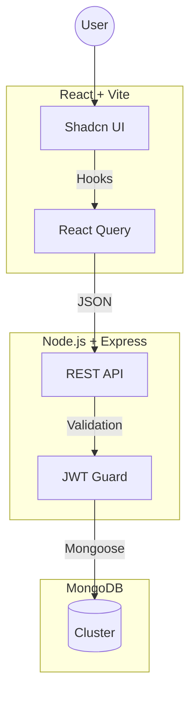
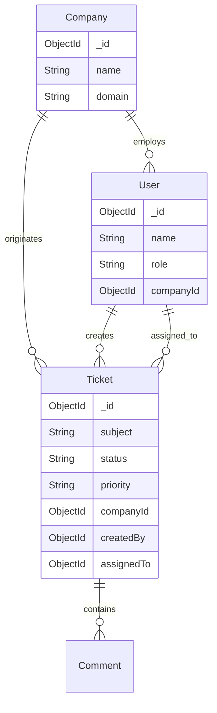

# 🎫 WorkDesks | Enterprise Helpdesk System


> **WorkDesks** is a robust, enterprise-grade support ticket management system designed to bridge the gap between customers and support teams. It features advanced data visibility controls for Company Managers, rich ticket interactions, and a seamless collaborative environment.

---

## 📚 Table of Contents

- [🚀 Key Features](#-key-features)
- [🏗️ System Architecture](#-system-architecture)
- [💾 Database Schema](#-database-schema)
- [🛠️ Technology Stack](#-technology-stack)
- [🏁 Getting Started](#-getting-started)
- [⌨️ Keyboard Shortcuts](#-keyboard-shortcuts)
- [🔌 API Reference](#-api-reference)
- [📂 Project Structure](#-project-structure)
- [👥 Contributing](#-contributing)

---

## 🚀 Key Features

### 🔐 Multi-Role Authentication & Access
- **Secure Auth**: JWT-based stateless authentication.
- **Role-Based Access Control (RBAC)**:
    - 👑 **Super Admin**: Full system control.
    - 🏢 **Manager**: manages their own Companies and Contacts. Can view tickets only from their managed entities.
    - 🎧 **Agent**: Handles ticket triage, replies, and status updates.
    - 👤 **Customer**: Creates tickets and tracks progress.

### 🏢 Company & Contact Management
- **Hierarchical Data**: Customers (Contacts) belong to Companies.
- **Manager Visibility**: Managers are assigned to Companies and see all associated tickets and contacts.
- **CRM Lite**: Track company details, active plans, and associated users.

### 🎫 Advanced Ticket Management
- **Smart Queues**: Sort by Priority, Status, and SLA.
- **Quick Actions**: One-click Forwarding, Closing, Deleting, and Merging (coming soon).
- **Rich Interaction**:
    - **Tiptap Editor**: Rich text replies with formatting.
    - **Internal Notes**: Private comments visible only to agents.
    - **Drafts**: Auto-saved reply drafts in local storage.
    - **Signatures**: Custom agent signatures appended to replies.
    - **Canned Responses**: Quick access to pre-written replies.
- **Sidebar Tools**: Quick access to Print, Timers, and Due Date editing.

### 📊 Analytics & Reporting
- **Dynamic Dashboard**: Activity charts using `recharts`.
- **Metrics**: Ticket volume trends, agent performance, and channel distribution.

### ⚡ Developer Experience
- **Global Search**: Instantaneous search across tickets and users.
- **Keyboard First**: `Alt+K` shortcuts for navigation.
- **Persistent Filters**: Smart filtering that remembers preferences.

---

## 🏗️ System Architecture

WorkDesks follows a **MERN** (MongoDB, Express, React, Node.js) architecture.

1.  **Frontend**: Vite + React SPA. Uses `react-query` for server state and `context` for auth/theme.
2.  **Backend**: Node.js + Express REST API.
3.  **Database**: MongoDB (with Mongoose ODM).



---

## 💾 Database Schema

The data model includes **Users**, **Tickets**, **Companies**, and **Comments**.



---

## 🛠️ Technology Stack

### Frontend
- **Framework**: React 18, Vite
- **Styling**: Tailwind CSS, Shadcn UI, Lucide Icons
- **State/Fetching**: TanStack React Query, React Router DOM
- **Forms**: React Hook Form, Zod
- **Editor**: Tiptap
- **Utils**: date-fns, sonner (toast)

### Backend
- **Runtime**: Node.js
- **Framework**: Express.js
- **Database**: MongoDB, Mongoose
- **Auth**: JWT (jsonwebtoken), bcryptjs
- **Validation**: express-validator

---

## 🏁 Getting Started

### Prerequisites
- **Node.js**: v18+
- **MongoDB**: v5+ (Local or Atlas)

### Installation

1.  **Clone the Repository**
    ```bash
    git clone https://github.com/developer-yasir/support-desk.git
    cd support-desk
    ```

2.  **Backend Setup**
    ```bash
    cd backend
    npm install
    
    # Create .env file
    echo "PORT=5000
    MONGODB_URI=mongodb://localhost:27017/supportdesk
    JWT_SECRET=super_secret_key" > .env
    
    # Run Server
    npm run dev
    ```

3.  **Frontend Setup**
    ```bash
    cd ../frontend
    npm install
    
    # Run Client
    npm run dev
    ```

4.  **Access App**
    Open `http://localhost:5173`.

---

## ⌨️ Keyboard Shortcuts

| Action | Shortcut |
| :--- | :--- |
| **New Ticket** | `Alt + N` |
| **Go to Tickets** | `Alt + T` |
| **Dashboard** | `Alt + D` |
| **Search** | `/` |

---

## 🔌 API Reference

Base URL: `http://localhost:5000/api`

### 🔐 Auth
- `POST /auth/register` - Register user
- `POST /auth/login` - Login

### 🎫 Tickets
- `GET /tickets` - List tickets (Role filtered)
- `POST /tickets` - Create ticket
- `GET /tickets/:id` - Get details
- `PUT /tickets/:id` - Update status/assignment
- `DELETE /tickets/:id` - Delete ticket
- `POST /tickets/:id/comments` - Reply (Internal/Public)
- `POST /tickets/:id/forward` - Forward ticket (Mock)

### 🏢 Companies
- `GET /companies` - List companies
- `GET /companies/:id` - Get company details
- `POST /companies` - Create company

---

## 📂 Project Structure

```text
support-desk/
├── backend/
│   ├── src/
│   │   ├── controllers/    # Business Logic
│   │   ├── middleware/     # Auth, Error Handling
│   │   ├── models/         # Database Schemas
│   │   └── routes/         # API Definition
│
├── frontend/
│   ├── src/
│   │   ├── components/     # UI Components (Alerts, Dialogs)
│   │   ├── contexts/       # AuthProvider
│   │   ├── pages/          # Full Views (TicketDetail, Dashboard)
│   │   └── lib/            # API Client (axios)
```

---

## 👥 Contributing

Contributions are welcome!

1.  Fork the Project
2.  Create your Feature Branch (`git checkout -b feature/AmazingFeature`)
3.  Commit your Changes (`git commit -m 'Add some AmazingFeature'`)
4.  Push to the Branch (`git push origin feature/AmazingFeature`)
5.  Open a Pull Request

---

## 📄 License

Distributed under the MIT License.

---

<p align="center">
  Built with ❤️ by <a href="https://github.com/developer-yasir">Yasir</a>
</p>
