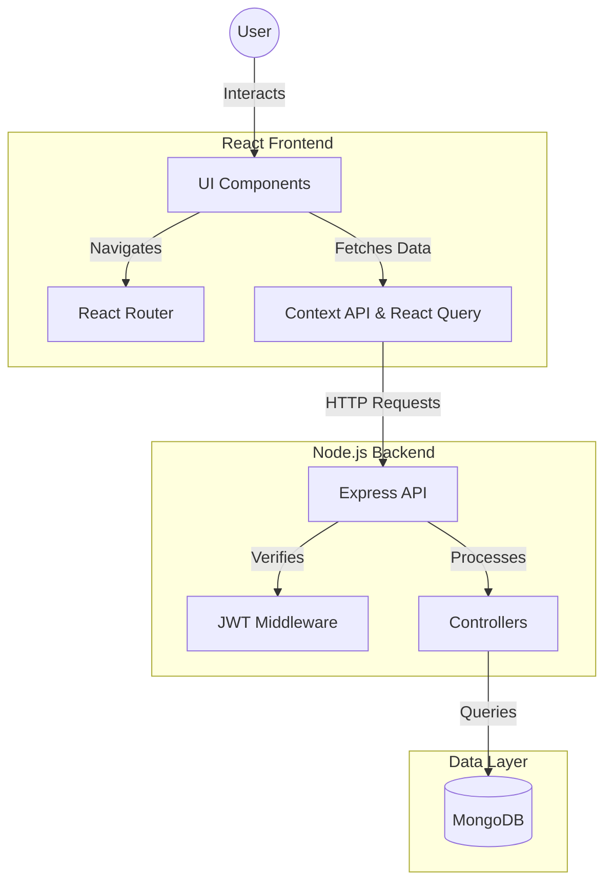
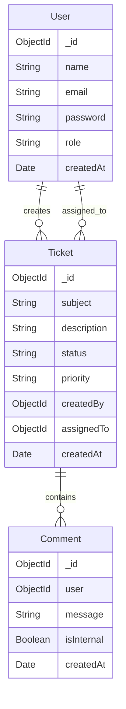

# 🎫 WorkDesks | Enterprise Helpdesk System


> **WorkDesks** is a robust, enterprise-grade support ticket management system designed to bridge the gap between customers and support teams. Built with performance and scalability in mind, it offers a seamless experience for tracking issues, managing agent workflows, and analyzing support metrics.

---

## 📚 Table of Contents

- [🚀 Key Features](#-key-features)
- [🏗️ System Architecture](#-system-architecture)
- [💾 Database Schema](#-database-schema)
- [🛠️ Technology Stack](#-technology-stack)
- [🏁 Getting Started](#-getting-started)
- [⌨️ Keyboard Shortcuts](#-keyboard-shortcuts)
- [🔌 API Reference](#-api-reference)
- [📂 Project Structure](#-project-structure)
- [👥 Contributing](#-contributing)

---

## 🚀 Key Features

### 🔐 Authentication & Authorization
- **Secure Auth**: JWT-based stateless authentication with secure cookie/storage management.
- **Role-Based Access Control (RBAC)**:
    - 👑 **Super Admin**: Full system control, user management, and system-wide settings.
    - 🏢 **Manager**: Team oversight, advanced analytics, and agent performance tracking.
    - 🎧 **Agent**: Efficient ticket triage, response management, and status updates.
    - 👤 **Customer**: Intuitive portal for creating tickets and tracking resolution progress.

### 🎫 Advanced Ticket Management
- **Smart Queues**: Auto-sorting based on priority, status, and SLA.
- **Rich Text Editor**: Markdown-supported comments and descriptions.
- **Real-time Status**: Instant updates on ticket progression (Open → In Progress → Resolved).
- **Attachments**: Support for file uploads and media sharing.

### 📊 Analytics Dashboard
- **Visual Metrics**: Interactive charts for ticket volume, resolution times, and channel distribution.
- **Agent Performance**: Leaderboards and satisfaction ratings.
- **Trend Analysis**: Compare metrics against previous periods.

### ⚡ Developer Experience
- **Global Search**: Instantaneous search across tickets, users, and content.
- **Keyboard First**: Optimized for power users with comprehensive keyboard shortcuts.
- **Persistent Filters**: Smart filtering that remembers your preferences across sessions.

---

## 🏗️ System Architecture

WorkDesks follows a modern **Client-Server** architecture. The frontend acts as a Single Page Application (SPA), communicating with the RESTful Backend API, which orchestrates data persistence with MongoDB.



---

## 💾 Database Schema

The data model is designed for flexibility and integrity.



---

## 🏁 Getting Started

### Prerequisites
- **Node.js**: v18+
- **MongoDB**: v5+ (Local or Atlas)
- **Git**

### Installation

1.  **Clone the Repository**
    ```bash
    git clone https://github.com/developer-yasir/support-desk.git
    cd support-desk
    ```

2.  **Backend Setup**
    ```bash
    cd backend
    npm install
    
    # Create .env file
    echo "PORT=5000
    MONGODB_URI=mongodb://localhost:27017/supportdesk
    JWT_SECRET=your_super_secret_key_change_this
    NODE_ENV=development" > .env
    
    # Run Backend
    npm run dev
    ```

3.  **Frontend Setup**
    ```bash
    cd ../frontend
    npm install
    
    # Run Frontend
    npm run dev
    ```

4.  **Access App**
    Open `http://localhost:5173` in your browser.

---

## ⌨️ Keyboard Shortcuts

Maximize productivity with these built-in shortcuts:

| Action | Shortcut (Mac/Win) | Description |
| :--- | :--- | :--- |
| **New Ticket** | `Alt + N` | Open the ticket creation modal |
| **Go to Tickets** | `Alt + T` | Navigate to the main ticket list |
| **Go to Dashboard** | `Alt + D` | Return to the main dashboard |
| **Go to Reports** | `Alt + R` | View analytics and reports |
| **Global Search** | `/` | Focus the search bar instantly |
| **Show Help** | `?` | Toggle the keyboard shortcuts cheat sheet |
| **Close Modal** | `Esc` | Close any active modal or dialog |

---

## 🔌 API Reference

Base URL: `http://localhost:5000/api`

### Auth
| Method | Endpoint | Description |
| :--- | :--- | :--- |
| `POST` | `/auth/register` | Register a new user |
| `POST` | `/auth/login` | Authenticate user & get token |
| `POST` | `/auth/logout` | Clear session |

### Tickets
| Method | Endpoint | Description |
| :--- | :--- | :--- |
| `GET` | `/tickets` | Get all tickets (filtered by role) |
| `POST` | `/tickets` | Create a new ticket |
| `GET` | `/tickets/:id` | Get ticket details |
| `PUT` | `/tickets/:id` | Update ticket status/priority |
| `POST` | `/tickets/:id/comments` | Add a comment to a ticket |

---

## 📂 Project Structure

```text
support-desk/
├── backend/                # Express Backend
│   ├── src/
│   │   ├── config/         # DB Connection
│   │   ├── controllers/    # Request Logic
│   │   ├── middleware/     # Auth & Error Handling
│   │   ├── models/         # Mongoose Schemas
│   │   └── routes/         # API Routes
│   └── server.js           # Entry Point
│
├── frontend/               # React Frontend
│   ├── src/
│   │   ├── components/     # Reusable UI Components
│   │   ├── contexts/       # Global State (Auth, Theme)
│   │   ├── hooks/          # Custom Hooks
│   │   ├── pages/          # Route Pages
│   │   └── lib/            # Utilities & API wrappers
│   └── vite.config.js      # Vite Configuration
└── README.md               # Documentation
```

---

## 👥 Contributing

Contributions are welcome!

1.  Fork the Project
2.  Create your Feature Branch (`git checkout -b feature/AmazingFeature`)
3.  Commit your Changes (`git commit -m 'Add some AmazingFeature'`)
4.  Push to the Branch (`git push origin feature/AmazingFeature`)
5.  Open a Pull Request

---

## 📄 License

Distributed under the MIT License. See `LICENSE` for more information.

---

<p align="center">
  Built with ❤️ by <a href="https://github.com/developer-yasir">Yasir</a>
</p>
